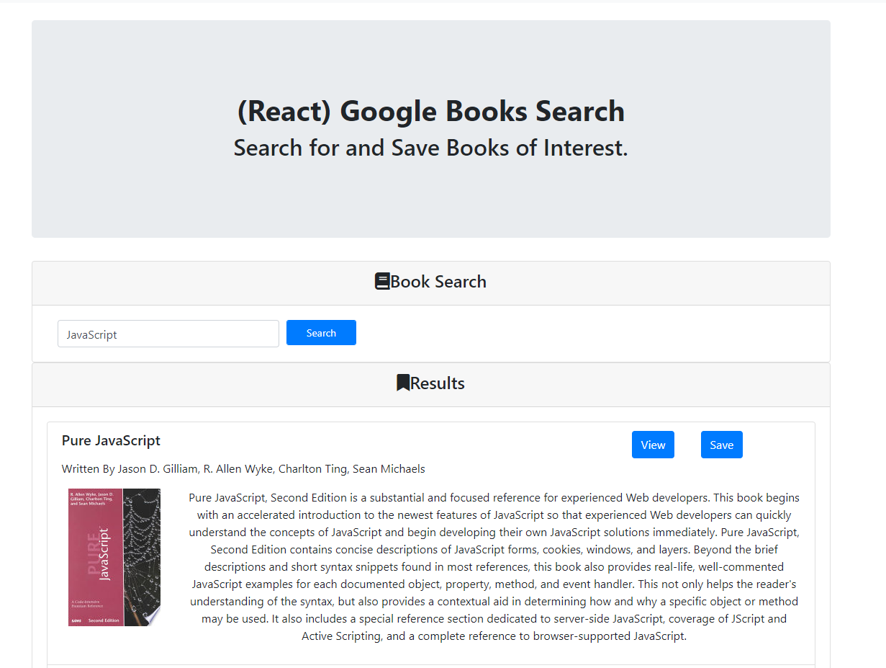
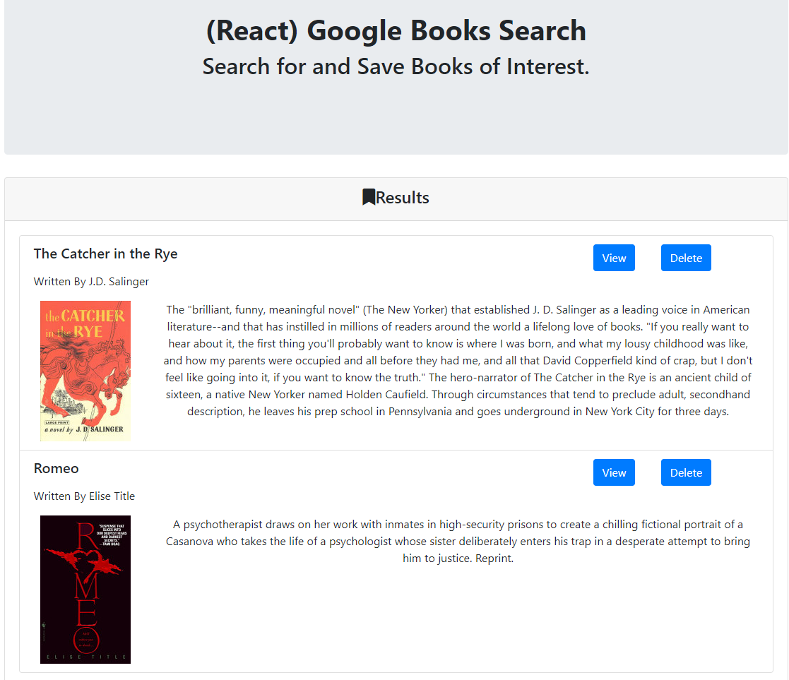

# Google Books Search

---

  ## Description
  > This app allow you to search books from Google using API and it stores your saved books.

---
  ## Getting Started
  - [Installation](#Installation)
  - [Test](#Test)
  - [Usage](#Usage)
  - [Preview](#Preview)
  - [Questions](#Questions)
  - [Contribute](#Contribute)
  - [Licenses](#Licenses)

---
  ## Installation
  
  ### Install
  To install, please type following command
  <pre> # Install dependencies
  npm install </pre>

  ### Clone
  > https://github.com/misterjaykay/google-books-search

---
  ## Test
  <pre> # NPM
  npm test </pre>

--- 
  ## Usage
  Install npm packages using NPM

--- 
  ## Preview

  ### Github Page Links
  [Click here to view deployed page](https://misterjaykay.github.io/google-books-search/)
  
  ### Screenshot
  
  

--- 
  ## Contribute

  ### How to contribute

  Please fork this repository.

---
  ## Questions

  ### Github Repository
  https://github.com/misterjaykay

  ### E-mail
  Please e-mail me any quetsions to misterjaykay@gmail.com

---
  ## Licenses
  None